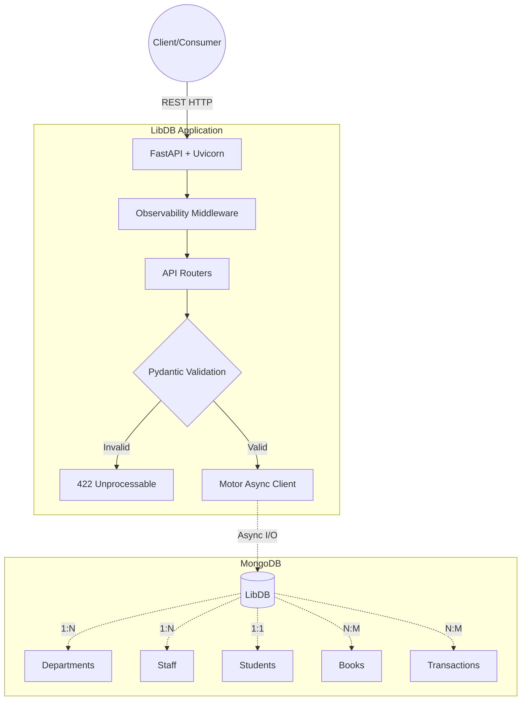
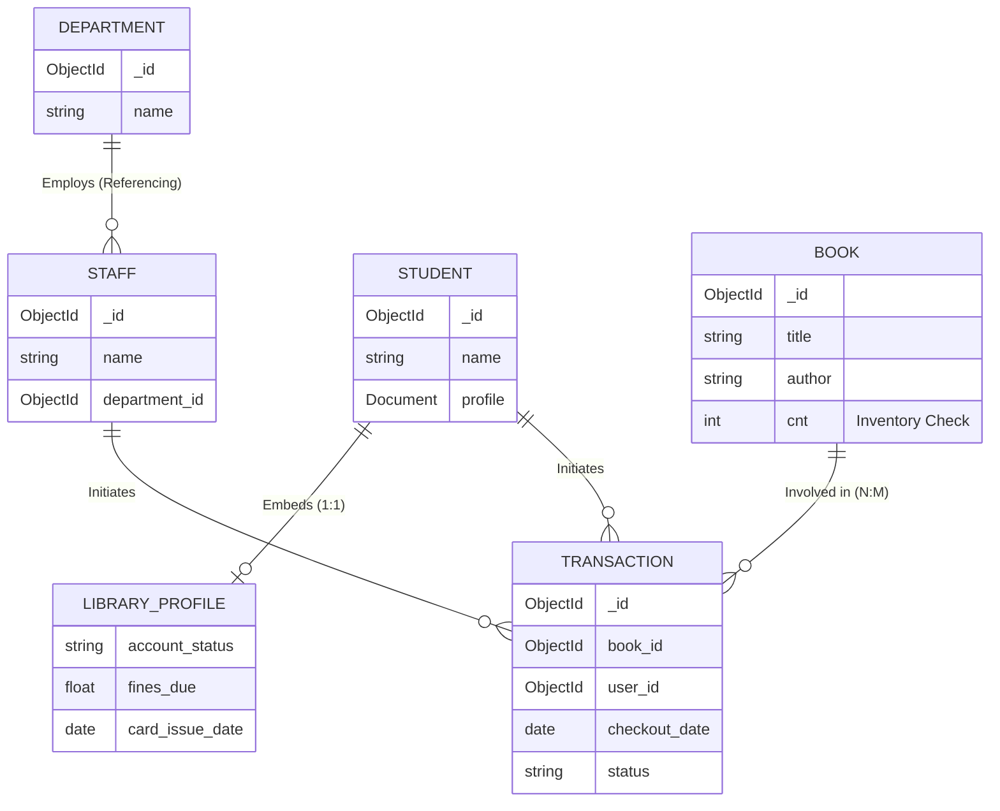
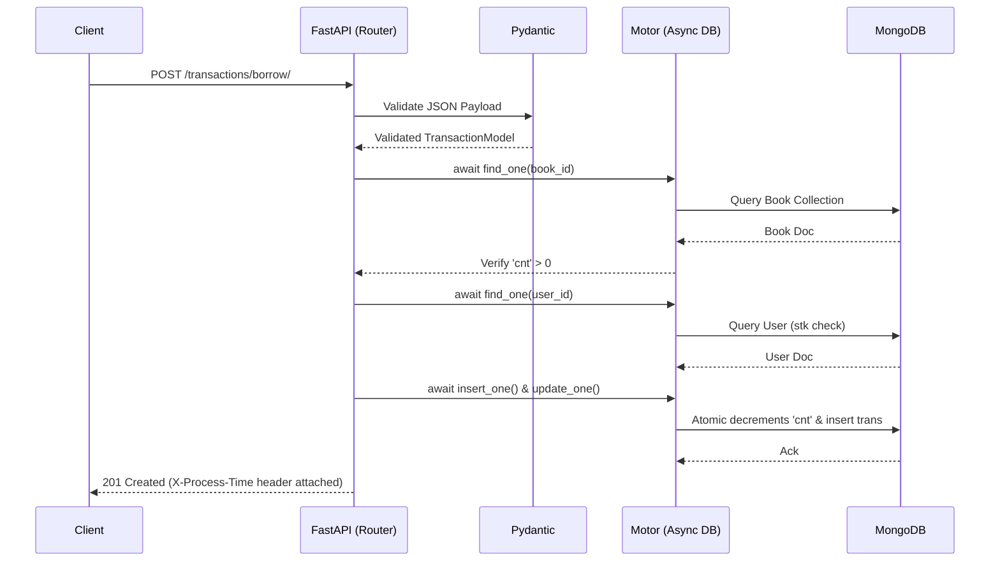

# LibDB: High-Performance Async Library Resource Engine 🚀


**LibDB** is an asynchronous, high-throughput RESTful API designed for university-scale library resource allocation. Bypassing frontend overhead, this engine focuses on raw data throughput, strict schema validation, and fully non-blocking I/O operations using an event-driven ASGI architecture.

---

##  System Architecture

The core of LibDB is built around a non-blocking event loop that handles thousands of concurrent requests without thread-locking, making it highly suitable for distributed environments and peak-load scenarios (like semester end checkouts).




---

##  Data Modeling & Relationships

LibDB leverages MongoDB's flexible schema while enforcing strict relational integrity through Pydantic. It utilizes an optimized mix of embedding (for fast reads) and referencing (to prevent array bloat).



---

##  High-Performance Checkout Flow

The `transactions` router handles the complex N:M mapping. It independently verifies user stock (`stk`) presence across both Staff and Student domains, and atomically updates the inventory counter (`cnt`) without race conditions.



---

##  Technology Stack

* **Framework:** [FastAPI](https://fastapi.tiangolo.com/) (High performance, easy to learn, fast to code, ready for production)
* **Server:** [Uvicorn](https://www.uvicorn.org/) (Lightning-fast ASGI server implementation)
* **Database:** [MongoDB](https://www.mongodb.com/) (NoSQL document database)
* **ODM / Driver:** [Motor](https://motor.readthedocs.io/) (Asynchronous Python driver for MongoDB)
* **Data Validation:** [Pydantic](https://www.google.com/search?q=https://docs.pydantic.dev/) (Data validation using Python type annotations)
* **Config Management:** `pydantic-settings`

---

## Project Structure

```text
LibDB/
├── .env                  # Environment variables
├── config.py             # Global settings manager
├── database.py           # AsyncIOMotorClient connection logic
├── main.py               # Engine entry point & middleware
├── models.py             # Strict Pydantic schemas
├── requirements.txt      # Python dependencies
└── routers/              # Modular API endpoints
    ├── __init__.py
    ├── books.py
    ├── departments.py
    ├── staff.py
    ├── students.py
    └── transactions.py

```

---

## Getting Started

### 1. Prerequisites

* Python 3.10+
* MongoDB Community Server 7.0+ (Running locally)
* Git

### 2. Environment Setup

```bash
# Clone the repository
git clone [https://github.com/AnicetusVIT/LibDB.git](https://github.com/AnicetusVIT/LibDB.git)
cd LibDB

# Initialize virtual environment
python3 -m venv venv
source venv/bin/activate

# Install dependencies
pip install -r requirements.txt

```

### 3. Configuration

Create a `.env` file in the root directory:

```env
MONGODB_URL=mongodb://localhost:27017
DATABASE_NAME=LibDB
APP_NAME=LibDB Resource Engine

```

### 4. Booting the Engine

Start the ASGI server:

```bash
uvicorn main:app --reload

```

Navigate to `http://localhost:8000/docs` to access the interactive Swagger UI.

---

## API Reference

| Domain | Method | Endpoint | Description |
| --- | --- | --- | --- |
| **Departments** | POST | `/departments/` | Create a new academic department |
|  | GET | `/departments/` | Fetch all departments |
| **Staff** | POST | `/staff/` | Register new staff (1:N to Dept) |
|  | GET | `/staff/{id}` | Fetch staff details |
|  | DELETE | `/staff/{id}` | Remove staff member |
| **Students** | POST | `/students/` | Register student (1:1 embedded profile) |
|  | GET | `/students/{id}` | Fetch student data |
| **Books** | POST | `/books/` | Add book to catalog (sets initial `cnt`) |
|  | PUT | `/books/{id}` | Update details or inventory |
| **Transactions** | POST | `/transactions/borrow/` | Checkout book (decrements `cnt`) |
|  | POST | `/transactions/return/{id}` | Return book (increments `cnt`) |

---

## 🔬 Observability & Error Handling

* **Global Exception Handler:** Intercepts standard server faults, returning clean, structured JSON to prevent data leakage.
* **Telemetry Middleware:** Injects an `X-Process-Time` header into every outbound HTTP response, allowing direct measurement of internal latency and query performance.

---

*Author: [Anicetus_7]* *Developed as part of an end-to-end distributed system architecture deep-work sprint.*
